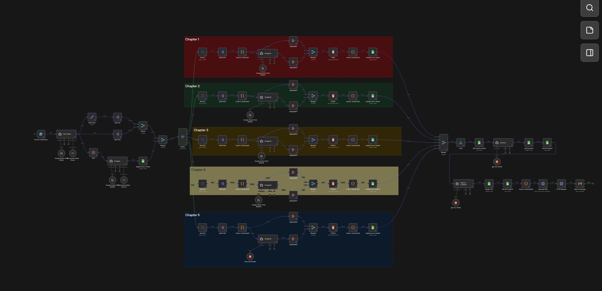
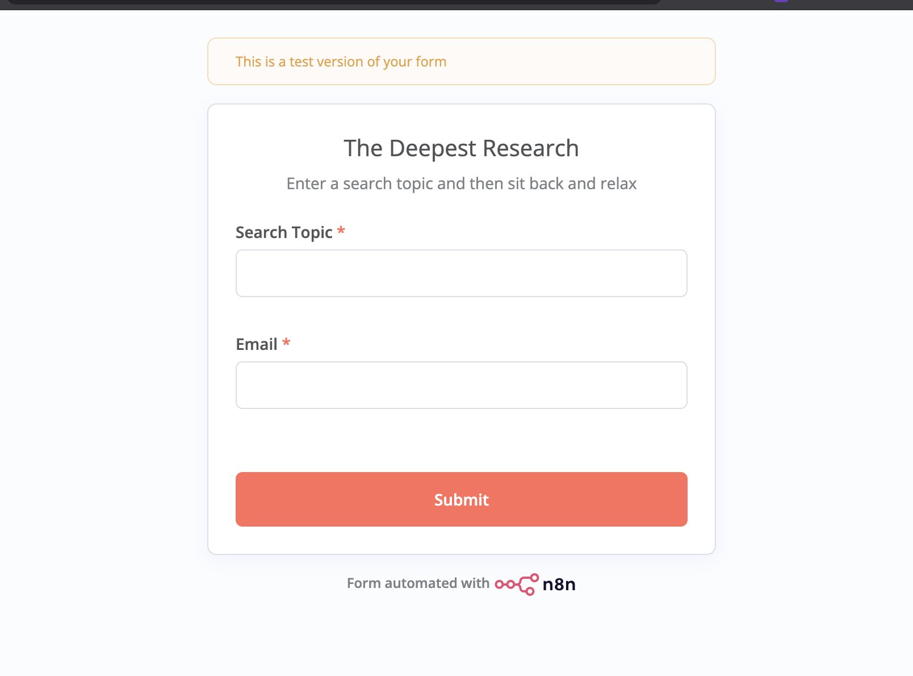
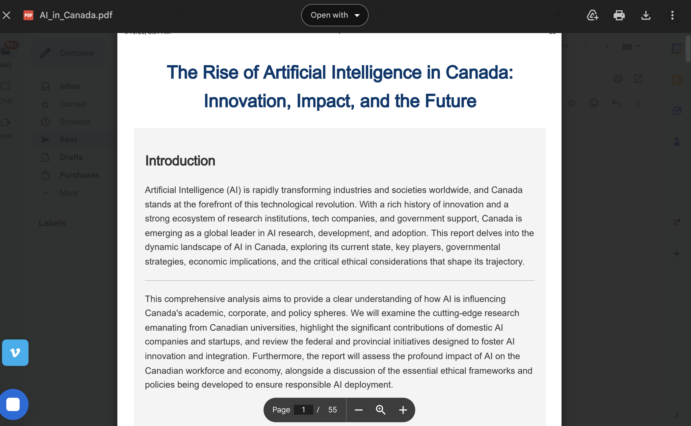
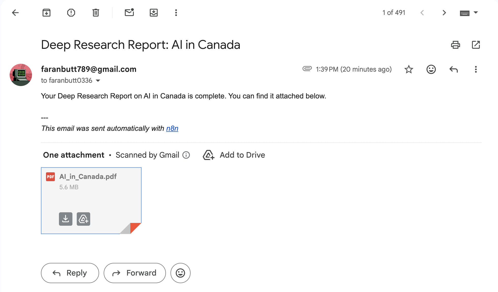

# Deep-Research-Agent
Deep Research Agent built with n8n, Tavily, Gemini-2.5-flash, GPT-oss-120b, APITemplate

## 📸 Workflow Overview

### 1. The n8n Workflow
This is the "brain" of the operation. It connects the AI nodes to handle the end-to-end process.

### 2. Topic Input & Configuration
You simply provide a topic and which email you want to send, and the AI handles the research and pdf creation with proper citation.

### 3. The Book
A fully formatted pdf essay with proper chapters currently it supports upto 5 chapters for a book

## 4. The Mail
It will automatically send the mail

